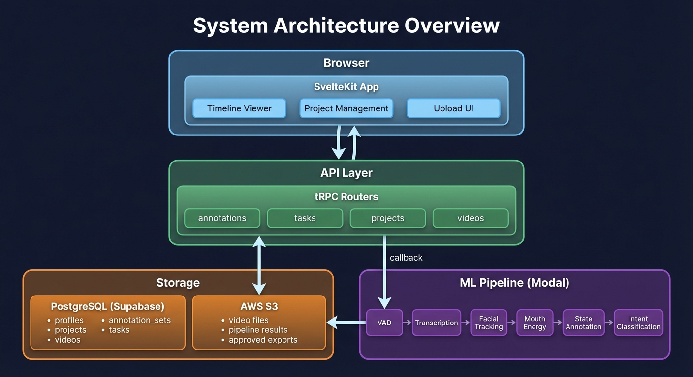
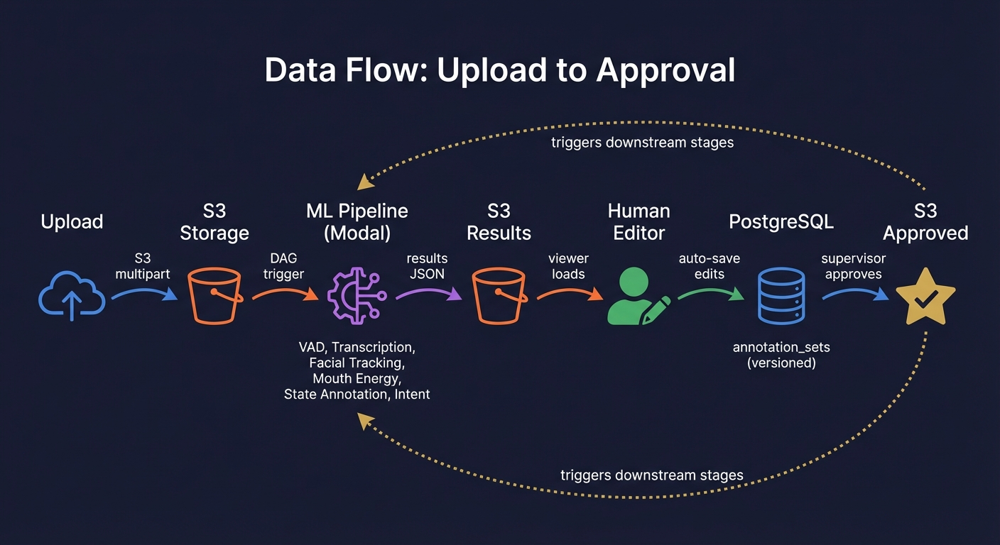
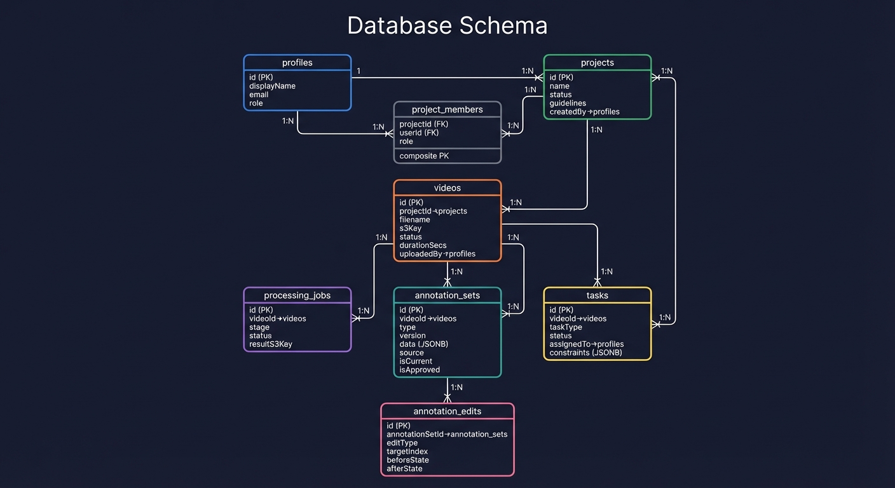
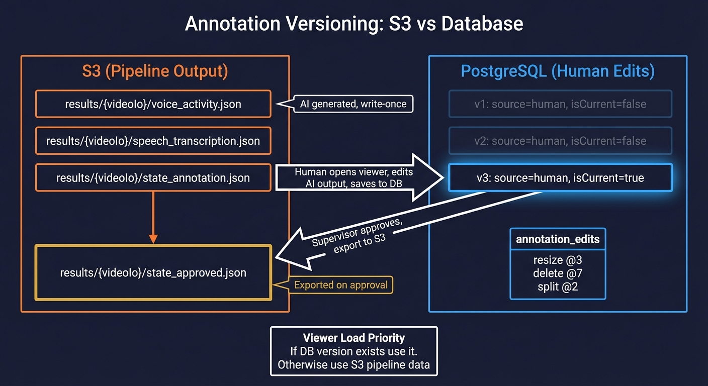
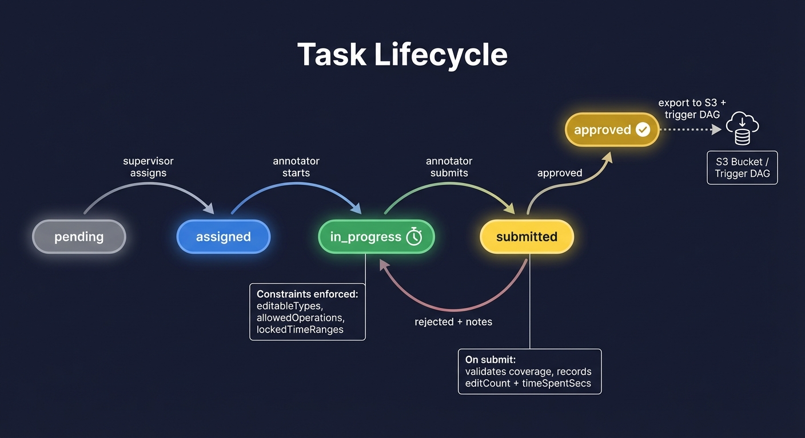

# Sidechain: Architecture & Data Model

A visual guide to how video annotation data flows through the system — from upload through ML pipeline, human editing, and supervisor approval.

---

## System Architecture



The system has four main layers:

**Browser** — A SvelteKit app (Svelte 5, Tailwind 4) with three main surfaces:
- **Upload UI**: S3 multipart upload with progress tracking
- **Project Management**: Projects, members, roles, guidelines
- **Timeline Viewer**: Multi-track annotation editor with 60fps drag-resize

**API Layer** — tRPC v11 routers with Zod validation:
- `annotations`: Versioned save/load/revert of human edits
- `tasks`: Task lifecycle (assign, start, submit, review)
- `projects`: CRUD, members, role-gated access
- `videos`: Upload metadata, processing status

**Storage** — Split between two systems (explained below):
- **PostgreSQL** (via Supabase): All relational data + human-edited annotations as versioned JSONB
- **AWS S3**: Video files, ML pipeline result JSONs, approved annotation exports

**ML Pipeline** — Python functions running on [Modal](https://modal.com):
- 7 stages forming a DAG: VAD, transcription, facial tracking, mouth energy, diarization, state annotation, intent classification
- Each stage reads input from S3, writes results back to S3
- DAG orchestration auto-cascades dependent stages on completion

---

## Data Flow



The end-to-end flow follows this path:

1. **Upload**: Video file goes to S3 via browser multipart upload with presigned URLs
2. **Pipeline trigger**: DAG orchestrator fires root stages (VAD, transcription, facial tracking) in parallel on Modal
3. **ML processing**: Each stage processes the video and writes result JSON to S3 (e.g., `results/{videoId}/voice_activity.json`)
4. **Viewer loads**: Timeline viewer fetches S3 results + checks DB for any human edits
5. **Human editing**: Annotator corrects AI output — resize boundaries, reclassify, split/merge, create/delete
6. **Auto-save**: Edits persist to PostgreSQL as versioned `annotation_sets` rows with full audit trail
7. **Approval**: Supervisor reviews, approves, data exports back to S3 — triggers downstream pipeline stages

The dotted feedback loop is the key design: approved human annotations become input for downstream AI stages, creating a human-in-the-loop refinement cycle.

---

## Database Schema



### Organizational Layer

| Table | Purpose | Key Relationships |
|-------|---------|-------------------|
| **profiles** | User identity (synced from Supabase auth) | Referenced by most tables via `createdBy`, `assignedTo`, etc. |
| **projects** | Annotation campaigns with guidelines | Has many `videos`, `project_members` |
| **project_members** | Role-based access (admin/supervisor/annotator) | Composite PK on `(projectId, userId)` |

### Video & Pipeline Layer

| Table | Purpose | Key Relationships |
|-------|---------|-------------------|
| **videos** | Uploaded video metadata + S3 key + processing status | Belongs to `project`, has many `processing_jobs`, `annotation_sets`, `tasks` |
| **processing_jobs** | One row per pipeline stage per video | Unique on `(videoId, stage)`. Tracks status, progress 0-100, result S3 key |

### Annotation Layer

| Table | Purpose | Key Relationships |
|-------|---------|-------------------|
| **annotation_sets** | Versioned annotation data (JSONB) | Belongs to `video`. Unique on `(videoId, type, version)`. Partial unique on `(videoId, type) WHERE is_current = true` |
| **annotation_edits** | Per-operation audit trail | Belongs to `annotation_set`. Records editType, targetIndex, before/after state |

### Task Layer

| Table | Purpose | Key Relationships |
|-------|---------|-------------------|
| **tasks** | Human annotation assignments | Belongs to `video`, assigned to `profile`. Contains `constraints` JSONB |
| **annotator_metrics** | QC metrics per annotator per project per period | Future use — kappa scores, boundary IoU, throughput |

---

## The S3 / Database Split



This is the most important architectural decision in the system. Pipeline output and human edits live in different places:

### S3: Pipeline Output (AI)

Pipeline stages write result JSON files to S3:
```
results/{videoId}/voice_activity.json       # VAD segments + per-frame probabilities
results/{videoId}/speech_transcription.json  # Word-level transcription
results/{videoId}/facial_tracking.json       # MediaPipe landmarks per frame
results/{videoId}/mouth_energy.json          # Blend shape energy at 10Hz
results/{videoId}/state_annotation.json      # Speaking/listening state regions
results/{videoId}/intent_classification.json # Intent labels per region
```

These are **write-once** — the pipeline writes them, the viewer reads them. They're never mutated.

### PostgreSQL: Human Edits

When a human edits annotations, the system creates versioned rows in `annotation_sets`:

```
annotation_sets:
  id: uuid
  videoId: uuid          -- which video
  type: 'state'          -- which annotation type
  version: 3             -- increments on each save
  data: JSONB            -- the FULL annotation array
  source: 'human'        -- was 'ai' before first human edit
  isCurrent: true        -- partial unique index guarantees one current per (videoId, type)
  isApproved: false      -- flipped by supervisor review
```

Each save also creates `annotation_edits` rows recording exactly what changed:
```
annotation_edits:
  editType: 'resize'     -- what operation
  targetIndex: 3         -- which annotation in the array
  beforeState: JSONB     -- full array snapshot before
  afterState: JSONB      -- full array snapshot after
```

### Load Priority

When the viewer opens:
1. Fetch all S3 pipeline results (always)
2. Check DB for `source = 'human'` annotation sets
3. **If DB version exists for a type, use it** — it represents human-corrected data
4. If no DB version, use the S3 pipeline output

This means the first time you view a video, you see raw AI output. After the first human save, you always see the human-edited version.

### Approval Export

When a supervisor approves a task:
1. Read the current `annotation_sets.data` from DB
2. Export to S3 at `results/{videoId}/{type}_approved.json`
3. Trigger downstream DAG stages (which read from S3)

This bridges the two storage systems — DB is canonical for editing, S3 is the interface for pipeline consumption.

---

## Task Lifecycle



Tasks are how human annotation work is assigned, constrained, and reviewed.

### States

| State | Meaning |
|-------|---------|
| **pending** | Created by supervisor, not yet assigned |
| **assigned** | Assigned to an annotator, visible in their task list |
| **in_progress** | Annotator has opened the viewer, timer running |
| **submitted** | Annotator finished, awaiting supervisor review |
| **approved** | Supervisor accepted — exports to S3, triggers downstream |
| **rejected** | Supervisor sent back with notes — returns to in_progress |

### Constraint System

Each task carries a `constraints` JSONB payload that controls what the annotator can do:

```typescript
interface TaskConstraints {
  editableTypes: AnnotationSetType[];      // e.g., ['state'] — only state track is editable
  allowedCategories?: string[];            // e.g., ['speaking', 'listening'] — restrict palette
  lockedTimeRanges?: TimeRange[];          // Regions that cannot be edited (e.g., excluded segments)
  allowedOperations?: EditType[];          // e.g., ['resize', 'classify', 'split', 'merge']
}
```

Constraints are enforced at two levels:
- **UI**: Buttons hidden, drag handles disabled, locked regions shown with striped overlay
- **Server**: tRPC `annotations.save` validates constraints before writing

### Task Types

| Task Type | Editable | Coverage Required | Typical Operations |
|-----------|----------|-------------------|--------------------|
| `verify_states` | States | Yes (contiguous) | resize, classify, split, merge |
| `verify_intents` | Intents | No (sparse) | all operations |
| `tag_session_bounds` | Session bounds | No | create, resize, delete |
| `tag_backchannels` | Backchannels | No (sparse) | create, delete, classify |

### Submit Validation

On submission, the system validates:
- **Coverage** (for states): annotations must partition the full video timeline with no gaps > 0.1s
- Records `editCount` and `timeSpentSecs` for QC metrics
- Forces a final auto-save before submission

---

## Annotation Data Shapes

All annotation data uses **time ranges in seconds** with half-open intervals `[start, end)`. Adjacent segments touch exactly: `[0, 5)` then `[5, 10)`.

### Pipeline Result Types

Each pipeline stage produces a JSON envelope:

```typescript
interface AnnotationMetadata {
  source_file: string;
  format_version: string;
  created_timestamp: string;
  total_secs: number;
  algorithm: { name: string; model?: string; version?: string; processing_time: number };
}

// Example: StateAnnotationResult
{
  metadata: AnnotationMetadata,
  data: StateAnnotation[]  // Array of time-ranged annotations
}
```

### Editable Annotation Types

| Type | Key Fields | Mutable by Humans | Immutable (AI provenance) |
|------|------------|-------------------|---------------------------|
| **StateAnnotation** | `time_range`, `category` (speaking/listening), `note`, `parameters` | time_range, category | note, parameters |
| **IntentAnnotation** | `time_range`, `intent_classification` (intent, intensity, valence, confidence, reasoning) | time_range, intent, intensity, valence | confidence, reasoning |
| **SpeechWord** | `time_range`, `speech` (word, speaker, confidence, speech_segment) | time_range, speaker | word, confidence, speech_segment |
| **UserLabel** | `time_range`, `text` | time_range, text | *(fully human-created)* |
| **BackchannelAnnotation** | `time_range`, `backchannel` (type, speaker, note) | time_range, type, note | speaker |

### Editing Operations

All implemented as pure functions in `editing/operations.ts`: `(items[], index, ...args) -> items[]`

| Operation | Behavior |
|-----------|----------|
| **create** | Insert at sorted position, default 1s duration at playhead |
| **resize** | Drag left/right edge to adjust time_range |
| **move** | Drag block body to shift both edges (3px threshold distinguishes from click) |
| **delete** | Remove annotation at index |
| **split** | Split at playhead into two annotations, both inherit original fields |
| **merge** | Combine adjacent same-category annotations into one |
| **classify** | Change category/intent/speaker fields |

---

## Key Design Principles

**AI proposes, humans correct.** The pipeline generates initial annotations. Humans refine them through a constrained editing interface. The audit trail tracks every correction.

**Versioned, not mutated.** Every save creates a new `annotation_sets` version. Nothing is overwritten. You can always revert to any previous version.

**S3 for bulk data, DB for transactional edits.** Pipeline results are large, write-once JSON files suited to object storage. Human edits need versioning, audit trails, and transactional guarantees suited to a relational database.

**Constraints at every level.** Task constraints are enforced in the UI (disabled controls), in the editor state (validation before commit), and on the server (tRPC rejects invalid saves). Defense in depth.

**60fps editing.** During drag operations, only inline CSS styles change — zero Svelte reactivity, zero store mutations. State commits happen on pointer release only. This keeps the annotation editor responsive even with thousands of annotations.
