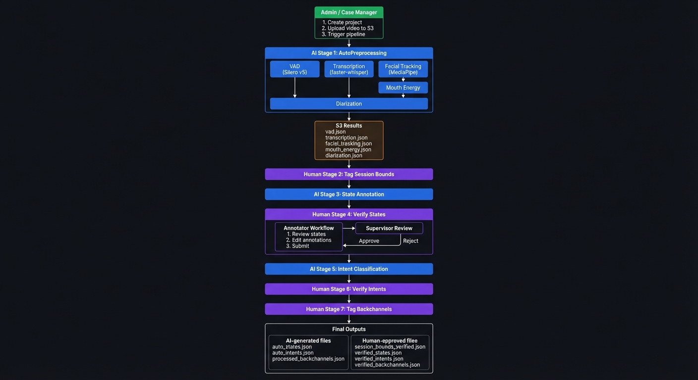
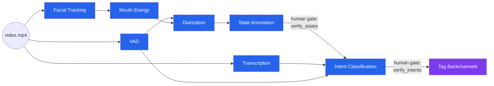
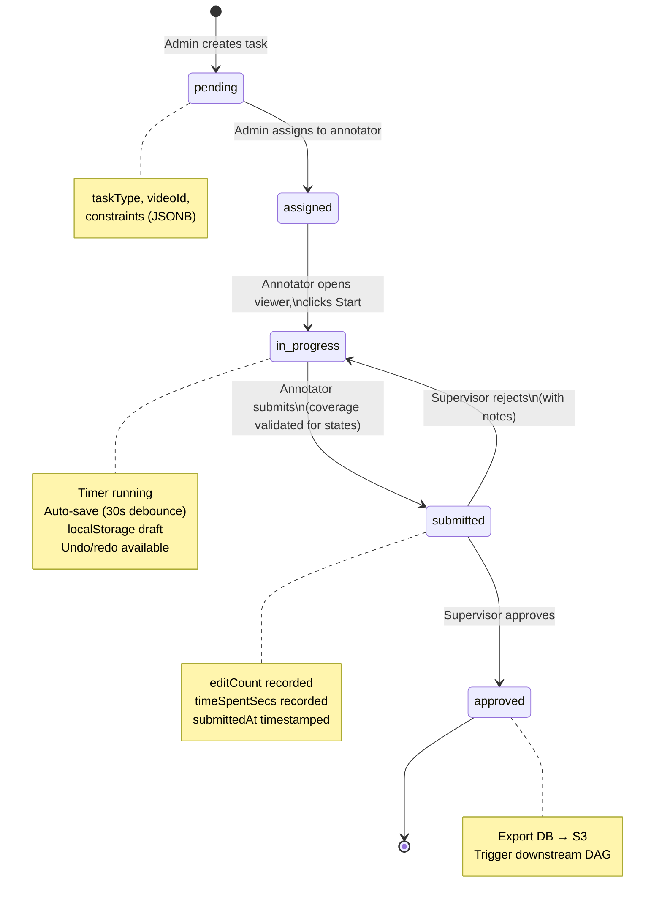
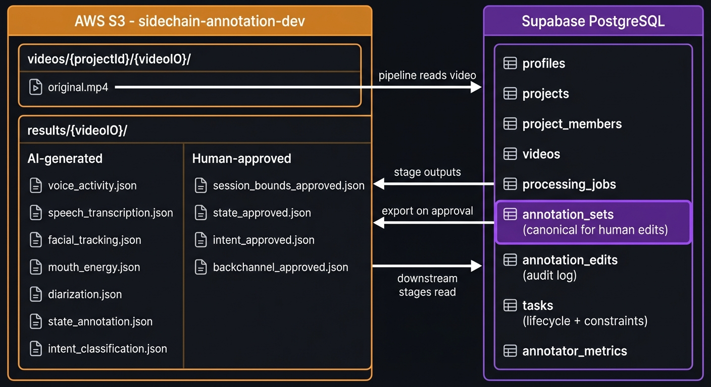
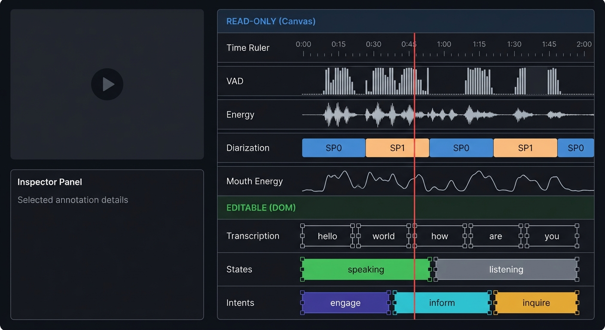

# System Flow: End-to-End Annotation Pipeline

High-level design flow covering roles, data streams, handoffs, and outputs.

---

## Roles

| Role | Capabilities | Typical Actions |
|------|-------------|-----------------|
| **Admin** (Case Manager) | Full access, project config, user management | Create projects, upload videos, assign tasks, configure constraints, view all data |
| **Supervisor** (Reviewer) | Read/update within project scope | Review submissions, approve/reject, write feedback notes, trigger re-annotation |
| **Annotator** | Edit within task constraints only | Open assigned tasks, edit annotations, submit for review |

---

## System Flow

The full 7-stage pipeline alternates between AI processing (blue) and human validation (purple). Admin initiates, AI proposes annotations, humans correct and approve at each gate before downstream stages fire.

**Stage summary:**

| Stage | Type | Task | Key Detail |
|-------|------|------|------------|
| 1. AutoPreprocessing | AI | VAD, Transcription, Facial Tracking, Mouth Energy, Diarization | Root stages fire in parallel; mouth_energy depends on facial_tracking; diarization depends on VAD + mouth_energy |
| 2. Tag Session Bounds | Human | `tag_session_bounds` | Mark exclusion ranges (music, noise, off-topic) |
| 3. State Annotation | AI | Rule-based conversion | Diarization → speaking/listening (contiguous partition) |
| 4. Verify States | Human | `verify_states` | Resize, classify, split, merge. Coverage REQUIRED. Supervisor gate before Stage 5 |
| 5. Intent Classification | AI | Claude API | Per speaking segment → intent + intensity + valence + confidence |
| 6. Verify Intents | Human | `verify_intents` | All operations incl. create/delete. Sparse (no coverage req). Supervisor gate |
| 7. Tag Backchannels | Human | `tag_backchannels` | Fully human-created. Listener feedback events |

---

## DAG: Pipeline Stage Dependencies

> Dashed borders = in-development stages. Human gates require supervisor approval before downstream stages fire.

---

## Data Stream Summary

### What's Collected Per Video

| Stream | Source | Format | Rate | Size | Editable |
|--------|--------|--------|------|------|----------|
| Voice Activity (VAD) | Silero VAD v5 | 10Hz windows | 10 samples/sec | ~50KB/min | No |
| Audio Energy | Derived from VAD | 10Hz, L+R channels | 10 samples/sec | (in VAD) | No |
| Speech Transcription | faster-whisper large-v3 | Per word | Variable | ~5KB/min | Yes (boundaries + speaker) |
| Facial Tracking | MediaPipe FaceLandmarker | Per frame | 10-30 FPS | ~1.5MB/min | No |
| Mouth Energy | Blend shape analysis | 10Hz windows | 10 samples/sec | ~100KB/min | No |
| Speaker Diarization | pyannote.audio 3.1 | Per segment | Variable | ~2KB/min | No |
| State Annotations | Rule-based from diarization | Per segment | Variable | ~1KB/min | Yes (all operations) |
| Intent Classifications | Claude API | Per speaking segment | Variable | ~3KB/min | Yes (all operations) |
| Backchannels | Human-created | Per event | Sparse | ~1KB/min | Yes (create/delete/classify) |
| Session Bounds | Human-created | Exclusion ranges | Sparse | <1KB | Yes (create/resize/delete) |

### What's Output at Each Gate

| Gate | Trigger | Input | Output | Next Step |
|------|---------|-------|--------|-----------|
| Video uploaded | Admin triggers pipeline | S3 video file | processing_jobs rows (7 stages, all pending) | Fire root stages |
| VAD complete | Modal response | Video audio | voice_activity.json | Unblock diarization (if facial_tracking done) |
| Transcription complete | Modal response | Video audio | speech_transcription.json | Unblock intent_classification (when states approved) |
| Facial tracking complete | Modal response | Video frames | facial_tracking.json | Fire mouth_energy |
| Mouth energy complete | Modal response | facial_tracking.json | mouth_energy.json | Unblock diarization |
| Diarization complete | Modal response | VAD + mouth_energy + video | diarization.json | Fire state_annotation |
| State annotation complete | Modal response | diarization.json | state_annotation.json | Create verify_states task |
| **Verify states approved** | Supervisor | Human-edited states | state_approved.json (S3) | Fire intent_classification |
| Intent classification complete | Modal response | States + transcription + VAD | intent_classification.json | Create verify_intents task |
| **Verify intents approved** | Supervisor | Human-edited intents | intent_approved.json (S3) | Create tag_backchannels task |
| **Backchannels approved** | Supervisor | Human-created backchannels | backchannel_approved.json (S3) | Video fully annotated |

---

## Task Assignment Flow

---

## Storage Architecture

Two parallel data paths — S3 for pipeline I/O (what Modal reads/writes) and DB for human editing (what the viewer reads/writes). The approval step bridges them by exporting DB → S3 before triggering downstream stages.

**Data flow arrows:**
- **Pipeline reads video**: S3 upload → processing_jobs trigger Modal stages
- **Stage outputs**: Modal writes results to S3 AI-generated files
- **Export on approval**: Supervisor approves → annotation_sets.data exported to S3 `{type}_approved.json`
- **Downstream stages read**: Next pipeline stage reads `_approved.json` as input

---

## Viewer: Read-Only vs Editable Tracks

The viewer splits into read-only Canvas tracks (pipeline data for reference) and editable DOM tracks (human-correctable annotations). In edit mode, DOM tracks render from the mutable `editorState`; in view mode, from immutable `annotationDataState`.

| Section | Rendering | Tracks | Source |
|---------|-----------|--------|--------|
| **Read-only** (blue) | Canvas | Time Ruler, VAD, Energy, Diarization, Mouth Energy | `annotationDataState` (S3 JSON) |
| **Editable** (green) | DOM | Transcription, States, Intents | `editorState` (mutable clones) in edit mode |

Editable tracks show resize handles on block edges during edit mode. The red playhead syncs across all tracks.

---

## Key Design Principles

1. **AI proposes, humans dispose** — AI handles scale, humans provide judgment. Every AI output goes through a human validation gate before feeding downstream stages.

2. **DB canonical for edits, S3 for pipeline I/O** — Human edits persist to `annotation_sets` (versioned JSONB). On approval, export to S3 in the format downstream stages expect. This keeps the editing path clean while maintaining pipeline compatibility.

3. **Supervisor gate prevents cascade of errors** — State corrections must be approved before intent classification runs. This prevents bad boundaries from polluting downstream LLM classifications.

4. **Constraints scope annotator focus** — Task Mode limits what's editable, what categories are available, and which time ranges are locked. Enforced at both UI and API levels. Annotators can't accidentally break work outside their assignment.

5. **Everything is audited** — `annotation_edits` logs every change with before/after state. `annotation_sets` versioning allows revert to any prior state. Task timing (duration, edit count) enables QC metrics.

6. **Immutable AI provenance** — When humans edit annotations, confidence scores and AI reasoning are preserved unchanged. The system tracks *that* a human correction happened, but doesn't overwrite the AI's original assessment. This enables future analysis of human-vs-AI agreement.
